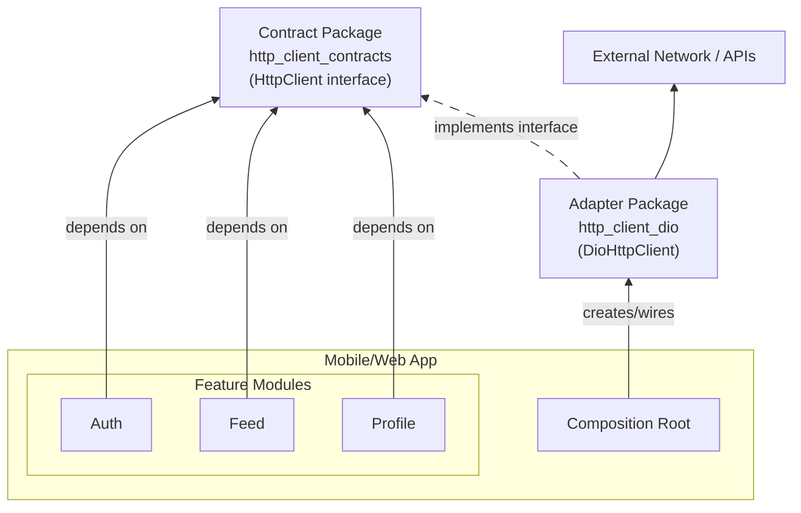

# HTTP Client Monorepo

Transport-agnostic HTTP contracts and concrete adapters for Dart and Flutter.

## Packages

| Package                                                           | Purpose                                                                               |
| ----------------------------------------------------------------- | ------------------------------------------------------------------------------------- |
| [`http_client_contracts`](packages/http_client_contracts)         | Core transport-agnostic contract (`HttpClient`, request/response models, exceptions). |
| [`http_client_dio`](packages/http_client_dio)                     | `dio` adapter that implements `HttpClient`.                                           |
| [`http_client_http`](packages/http_client_http)                   | `package:http` adapter that implements `HttpClient`.                                  |
| [`http_client_contract_test`](packages/http_client_contract_test) | Shared conformance test suite for adapter packages.                                   |
| [`example`](example)                                              | Flutter example app using the contracts and adapters.                                 |

## Architecture

Keep feature/business code dependent on `http_client_contracts` only.
Pick and wire one concrete adapter at your composition root.



## Quick Start

```bash
dart pub get
```

Use contracts in app/business layers:

```dart
import 'package:http_client_contracts/http_client_contracts.dart';
```

Wire one adapter in composition/infrastructure:

```dart
import 'package:http_client_contracts/http_client_contracts.dart';
import 'package:http_client_dio/http_client_dio.dart';

final HttpClient client = DioHttpClient();
```

## Development

Run analysis/tests per package while working:

```bash
dart analyze
dart test
```

For adapter behavior validation, use `http_client_contract_test` in adapter package tests.

## Package Docs

- Contracts: [`packages/http_client_contracts/README.md`](packages/http_client_contracts/README.md)
- Dio adapter: [`packages/http_client_dio/README.md`](packages/http_client_dio/README.md)
- package:http adapter: [`packages/http_client_http/README.md`](packages/http_client_http/README.md)
- Contract test suite: [`packages/http_client_contract_test/README.md`](packages/http_client_contract_test/README.md)
